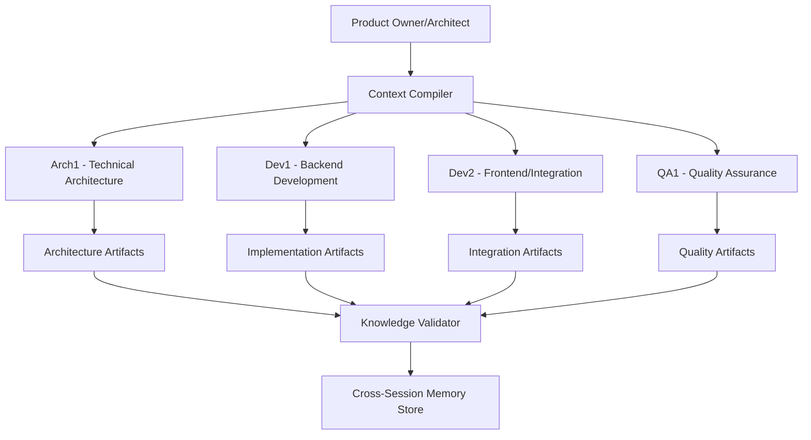
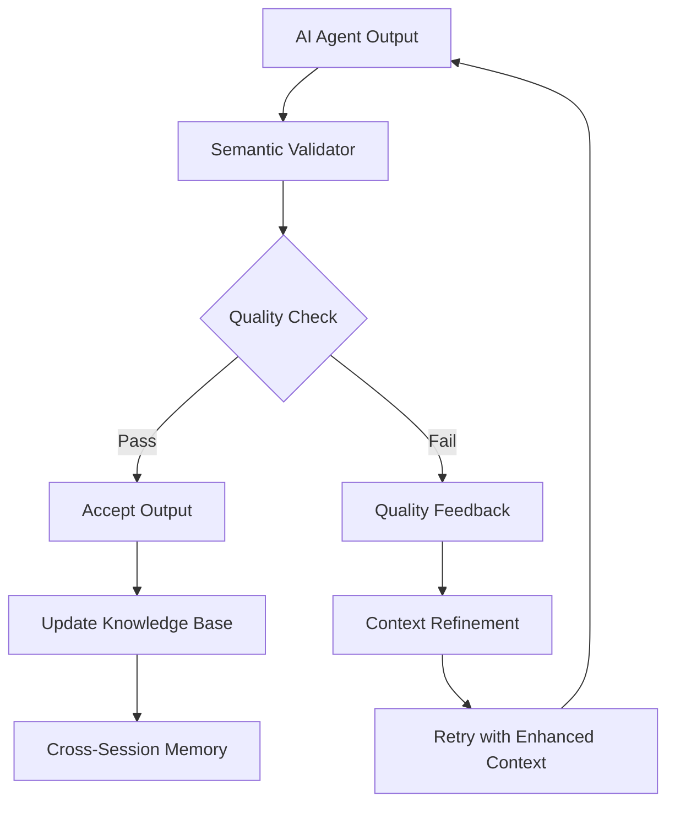

# **AI-Native Development Paradigm - Core Framework**
*Designing the Future of Software Development with Intelligent Agents*

---

## **🧠 PARADIGM OVERVIEW**

### **The Revolution**
Traditional software development assumes **human cognition**: memory retention, contextual learning, intuitive problem-solving. AI agents have **perfect recall within context** but **zero memory across sessions** and **no intuitive understanding**.

**This fundamental difference requires a completely new development methodology.**

### **Core Principles**

#### **1. Context Precision Principle**
> "Each AI agent receives the **exact knowledge required** for their role - no more, no less"

- **Over-context** = Degraded performance, noise, confusion
- **Under-context** = Incomplete understanding, poor decisions
- **Perfect-context** = Optimal performance, consistent quality

#### **2. Knowledge Compression Principle** 
> "Complex domain knowledge must be compressed into **semantic ontologies** that maximize understanding while minimizing context burden"

- Use **canonical patterns** for common scenarios
- Create **decision trees** for complex logic
- Build **template systems** for repeatability

#### **3. Zero-Drift Principle**
> "Quality must be **measurable and enforceable** across all AI agent interactions"

- Every output has **quality checkpoints**
- **Semantic validation** prevents interpretation drift
- **Continuous feedback loops** improve the system

#### **4. Interface Contract Principle**
> "Handoffs between AI agents must be **semantically perfect** with zero ambiguity"

- **Structured data formats** for all communications
- **Validation schemas** for every interface
- **Error handling** for edge cases

---

## **🏗️ SYSTEM ARCHITECTURE**

### **AI Agent Roles & Boundaries**



### **Context Flow Architecture**

```yaml
Context_Distribution_System:
  Input: "Complete Project Knowledge Base"
  
  Processing:
    - Role_Context_Extraction: "Extract role-specific knowledge"
    - Semantic_Compression: "Compress using ontologies"
    - Quality_Validation: "Ensure completeness and accuracy"
    - Format_Optimization: "Optimize for AI consumption"
  
  Output:
    Arch1_Context: "Architecture-specific knowledge packet"
    Dev1_Context: "Backend development knowledge packet"  
    Dev2_Context: "Frontend/integration knowledge packet"
    QA1_Context: "Quality assurance knowledge packet"
  
  Feedback_Loop:
    - Performance_Monitoring: "Track agent effectiveness"
    - Context_Refinement: "Improve based on outcomes"
    - Drift_Detection: "Identify and correct quality degradation"
```

---

## **📊 SEMANTIC ONTOLOGY FRAMEWORK**

### **Universal Knowledge Structure**

Every piece of project knowledge follows this canonical structure:

```json
{
  "knowledge_id": "unique_identifier",
  "knowledge_type": "requirement|specification|constraint|pattern|template",
  "role_relevance": ["arch1", "dev1", "dev2", "qa1"],
  "priority": "critical|important|nice-to-have",
  "
  
  "what": {
    "objective": "What needs to be accomplished",
    "success_criteria": "How success is measured",
    "constraints": "Limitations and boundaries"
  },
  
  "how": {
    "approach": "Technical approach or methodology",
    "tools": "Required technologies and frameworks",
    "patterns": "Canonical patterns to follow"
  },
  
  "when": {
    "dependencies": "Prerequisites and dependencies",
    "timeline": "Expected completion timeframe",
    "milestones": "Key checkpoints"
  },
  
  "why": {
    "business_value": "Business rationale",
    "technical_rationale": "Technical reasoning",
    "risk_mitigation": "Risks being addressed"
  },
  
  "quality_gates": {
    "acceptance_criteria": "Must-meet requirements",
    "testing_requirements": "Validation methods",
    "performance_benchmarks": "Performance expectations"
  },
  
  "context_compression": {
    "summary": "One-sentence summary",
    "key_concepts": "Essential concepts list",
    "reference_patterns": "Links to canonical patterns"
  }
}
```

### **Role-Specific Ontologies**

#### **Architecture Ontology**
```yaml
Architecture_Knowledge:
  Components:
    - System_Design: "High-level architecture decisions"
    - Integration_Patterns: "How systems connect"
    - Scalability_Requirements: "Performance and scale needs"
    - Security_Framework: "Security patterns and requirements"
  
  Deliverables:
    - Architecture_Diagrams: "Visual system representations"
    - API_Specifications: "Interface contracts"
    - Technology_Selections: "Platform and tool choices"
    - Non_Functional_Requirements: "Performance, security, scalability"
  
  Quality_Measures:
    - Consistency: "Internal logical consistency"
    - Completeness: "All requirements addressed"
    - Feasibility: "Technical achievability"
    - Maintainability: "Long-term sustainability"
```

#### **Development Ontology**
```yaml
Development_Knowledge:
  Components:
    - Implementation_Specifications: "Detailed coding requirements"
    - API_Contracts: "Exact interface definitions"
    - Data_Models: "Database and data structure designs"
    - Business_Logic: "Application logic requirements"
  
  Deliverables:
    - Source_Code: "Functional implementation"
    - Unit_Tests: "Comprehensive test coverage"
    - Documentation: "Technical documentation"
    - Configuration: "Deployment configurations"
  
  Quality_Measures:
    - Correctness: "Meets specifications exactly"
    - Performance: "Meets performance benchmarks"
    - Maintainability: "Code quality and structure"
    - Security: "Secure implementation practices"
```

#### **Quality Assurance Ontology**
```yaml
QA_Knowledge:
  Components:
    - Test_Strategies: "Comprehensive testing approaches"
    - Acceptance_Criteria: "Success measurement criteria"
    - Performance_Benchmarks: "Expected performance metrics"
    - Security_Requirements: "Security validation needs"
  
  Deliverables:
    - Test_Plans: "Detailed testing procedures"
    - Test_Cases: "Specific test scenarios"
    - Test_Results: "Validation outcomes"
    - Quality_Reports: "Quality assessment summaries"
  
  Quality_Measures:
    - Coverage: "Test coverage completeness"
    - Accuracy: "Test result reliability"
    - Efficiency: "Testing process efficiency"
    - Repeatability: "Consistent test outcomes"
```

---

## **🔧 CONTEXT COMPRESSION STRATEGIES**

### **1. Pattern-Based Compression**
Instead of explaining concepts repeatedly, reference canonical patterns:

```markdown
❌ BAD (High Context Burden):
"Create a REST API endpoint that accepts JSON data, validates the input using a schema, processes the business logic, handles errors gracefully, logs all activities, and returns appropriate HTTP status codes with JSON responses. Make sure to implement proper authentication and authorization checks..."

✅ GOOD (Compressed Reference):
Pattern: `STANDARD_REST_ENDPOINT`
Input: `CustomerData` (ref: schema_customer_v2)
Business Logic: `CreateCustomerWorkflow` (ref: workflow_customer_creation)
Auth: `RBAC_CUSTOMER_WRITE` (ref: auth_patterns)
Quality: `API_QUALITY_STANDARD` (ref: quality_api_checklist)
```

### **2. Hierarchical Knowledge Structure**
```yaml
Project_Knowledge:
  Level_1_Core: "Essential concepts every agent needs"
  Level_2_Role: "Role-specific detailed knowledge"
  Level_3_Task: "Task-specific implementation details"
  Level_4_Reference: "External documentation and resources"
```

### **3. Just-In-Time Context Loading**
Agents receive:
- **Base Context**: Core project understanding
- **Role Context**: Role-specific detailed knowledge  
- **Task Context**: Specific task requirements
- **Reference Context**: Additional resources as needed

---

## **⚡ QUALITY ASSURANCE MECHANISMS**

### **Real-Time Quality Gates**



### **Drift Prevention System**

```python
# Conceptual Quality Monitoring
class QualityMonitor:
    def __init__(self):
        self.baseline_patterns = load_canonical_patterns()
        self.drift_threshold = 0.15  # 15% deviation tolerance
    
    def validate_output(self, agent_output, expected_pattern):
        semantic_similarity = calculate_similarity(
            agent_output, 
            expected_pattern
        )
        
        if semantic_similarity < (1.0 - self.drift_threshold):
            return QualityResult(
                status="DRIFT_DETECTED",
                recommendation="CONTEXT_ENHANCEMENT_REQUIRED",
                missing_elements=identify_gaps(agent_output, expected_pattern)
            )
        
        return QualityResult(status="APPROVED")
```

### **Cross-Session Continuity**

```yaml
Memory_Store:
  Project_State:
    - Current_Phase: "Development phase and progress"
    - Decision_History: "Key decisions and rationale"
    - Quality_Metrics: "Performance trends and issues"
    - Pattern_Effectiveness: "Which patterns work best"
  
  Agent_Performance:
    - Context_Effectiveness: "Which contexts produce best results"
    - Common_Errors: "Frequent issues and resolutions"
    - Optimization_Opportunities: "Areas for improvement"
  
  Knowledge_Evolution:
    - Pattern_Updates: "Improved patterns based on experience"
    - Context_Refinements: "Enhanced context definitions"
    - Quality_Improvements: "Better quality measures"
```

---

## **🚀 IMPLEMENTATION STRATEGY**

### **Phase 1: Foundation (Weeks 1-2)**
1. **Define Semantic Ontologies** for each role
2. **Create Context Templates** for knowledge packaging
3. **Build Quality Validation Framework** 
4. **Establish Baseline Patterns** for common tasks

### **Phase 2: Role Specialization (Weeks 3-4)**
1. **Train Role-Specific Contexts** (Arch1, Dev1, Dev2, QA1)
2. **Implement Handoff Protocols** between roles
3. **Deploy Quality Monitoring** systems
4. **Test Cross-Session Continuity** mechanisms

### **Phase 3: Optimization (Weeks 5-6)**
1. **Refine Context Compression** based on performance data
2. **Enhance Quality Gates** with learned patterns
3. **Optimize Knowledge Distribution** for efficiency
4. **Scale to Additional Projects** and validate transferability

---

## **📈 SUCCESS METRICS**

### **Context Efficiency Metrics**
- **Context Utilization Rate**: % of provided context actually used
- **Context Completeness Score**: % of required knowledge provided
- **Context Precision Score**: Relevance of provided information

### **Quality Consistency Metrics**
- **Cross-Session Quality Variance**: Consistency across different sessions
- **Drift Detection Rate**: How quickly quality issues are identified
- **Pattern Adherence Score**: Compliance with canonical patterns

### **Development Velocity Metrics**
- **Time to First Working Solution**: Speed of initial implementation
- **Iteration Cycles**: Number of refinement cycles required
- **Knowledge Transfer Efficiency**: Speed of role-to-role handoffs

### **System Learning Metrics**
- **Pattern Effectiveness**: Success rate of different patterns
- **Context Optimization Rate**: Improvement in context efficiency over time
- **Quality Gate Accuracy**: Precision of quality validation systems

---

## **🔮 FUTURE EVOLUTION**

### **Advanced Capabilities**
- **Dynamic Context Adaptation**: AI agents that optimize their own context requirements
- **Cross-Project Pattern Mining**: Automatic extraction of successful patterns
- **Predictive Quality Assurance**: AI that predicts and prevents quality issues
- **Autonomous Knowledge Compression**: Self-improving semantic ontologies

### **Scaling Considerations**
- **Multi-Project Orchestration**: Managing multiple projects with shared knowledge
- **Team Scaling**: Adding specialized AI agents for complex projects
- **Enterprise Integration**: Connecting with existing development tools and processes
- **Knowledge Marketplace**: Sharing successful patterns across organizations

---

**This framework represents the foundation for the next generation of software development - where AI agents work with human-level understanding but superhuman consistency and speed.**

**The goal: Perfect knowledge distribution + Zero quality drift + Maximum development velocity**

*🚀 Ready to revolutionize how software gets built? Let's make it happen.*