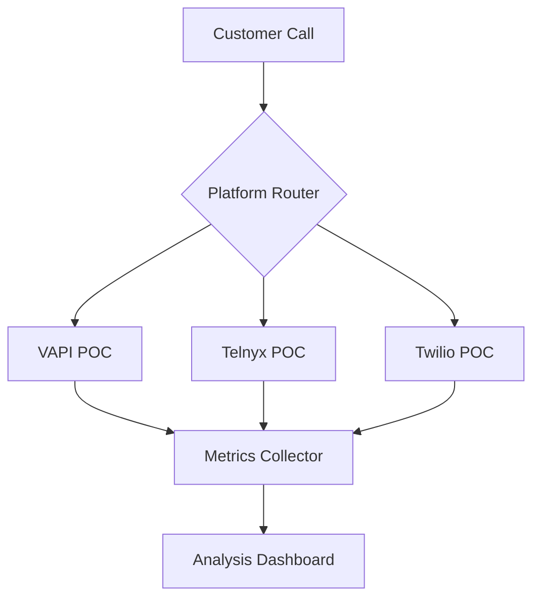
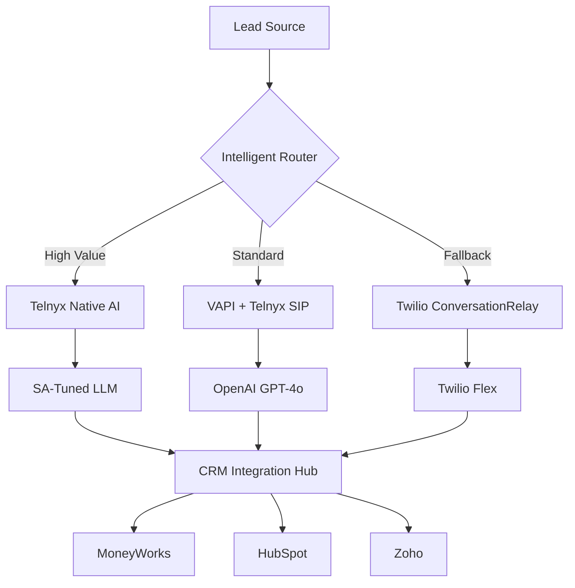
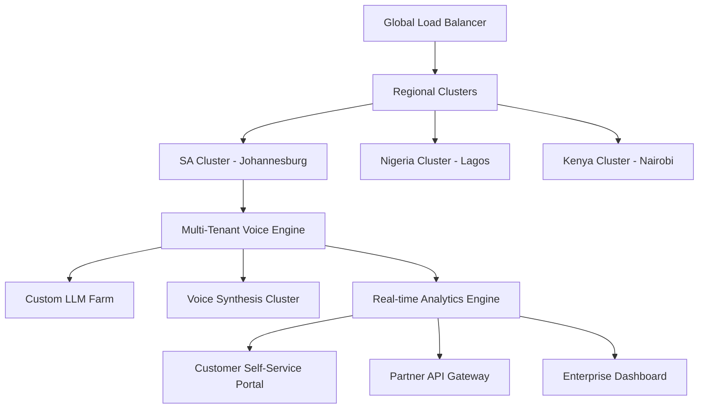

# **OPERATION VOICEBRIDGE - Master Execution Plan**
*Dominating the South African Voice AI Market Through Strategic Platform Orchestration*

---

## **🎯 MISSION STATEMENT**

**Operation VoiceBridge** is AgileWorks' strategic initiative to capture 10% of South Africa's R12B call center market by 2026 through revolutionary AI voice technology. We will achieve 90% cost reduction compared to traditional call centers while delivering sub-second response times and instant customer deployment capabilities.

**Code Name Rationale**: "VoiceBridge" represents bridging the gap between human and AI communication, bridging traditional telephony with modern AI, and bridging South African businesses with their customers through intelligent voice automation.

---

## **📋 EXECUTIVE SUMMARY**

### **Strategic Objectives**
1. **Technical Dominance**: Achieve <800ms average response latency across all platforms
2. **Cost Leadership**: Deliver voice AI services at <$0.05/minute (R0.30/min)
3. **Market Penetration**: Onboard 500+ enterprise customers by 2026
4. **Revenue Target**: Generate R150M ARR by Year 3
5. **Competitive Moat**: Build Africa's most advanced voice AI infrastructure

### **Success Metrics**
- **Phase 1**: 3 working POCs, platform selection complete (90 days)
- **Phase 2**: 10 pilot customers, hybrid architecture operational (180 days)
- **Phase 3**: 100+ customers, full automation platform (365 days)

---

## **🗓️ PHASE-GATE EXECUTION TIMELINE**

### **PHASE 1: RECONNAISSANCE & VALIDATION (Days 1-90)**
*"Prove the Technology, Validate the Market"*

#### **Phase Objectives**
- Deploy and benchmark all 3 platform POCs
- Establish baseline performance metrics
- Validate South African market assumptions
- Select winning technology combination

#### **Key Deliverables**
| Week | Deliverable | Owner | Success Criteria |
|------|-------------|-------|------------------|
| 1-2 | Platform POC Deployment Scripts | DevOps Lead | All 3 platforms operational |
| 3-4 | SA-Optimized LLM Prompts | Conversation Designer | >85% context accuracy |
| 5-6 | Cross-Platform Testing Framework | QA Lead | Automated metrics collection |
| 7-8 | Performance Benchmark Report | Solutions Architect | Platform ranking complete |
| 9-10 | Market Validation Study | Product Manager | Customer feedback analyzed |
| 11-12 | Technology Selection Decision | CTO | Architecture roadmap approved |

#### **Phase Gate Criteria**
- [ ] All POCs demonstrate <1s response latency
- [ ] Cost models validated with real usage data
- [ ] At least 10 potential customers identified and qualified
- [ ] Technical architecture approved by engineering leadership
- [ ] Regulatory compliance path established

---

### **PHASE 2: FOUNDATION & INTEGRATION (Days 91-180)**
*"Build the Engine, Power the First Customers"*

#### **Phase Objectives**
- Implement hybrid architecture based on Phase 1 learnings
- Automate customer onboarding process
- Deploy first 10 pilot customers
- Establish operational monitoring and support

#### **Key Deliverables**
| Week | Deliverable | Owner | Success Criteria |
|------|-------------|-------|------------------|
| 13-14 | Hybrid Architecture Implementation | Senior Architect | Multi-platform routing operational |
| 15-16 | Customer Onboarding Automation | Backend Lead | <10min customer provisioning |
| 17-18 | CRM/ERP Integration Suite | Integration Engineer | MoneyWorks/HubSpot/Zoho connected |
| 19-20 | Monitoring & Analytics Dashboard | DevOps Engineer | Real-time metrics visible |
| 21-22 | Pilot Customer Deployment | Customer Success | 10 customers operational |
| 23-24 | Support Processes & Documentation | Operations Manager | 24/7 support capability |

#### **Phase Gate Criteria**
- [ ] Hybrid architecture handles 100+ concurrent calls
- [ ] Customer onboarding fully automated
- [ ] All pilot customers showing positive ROI
- [ ] Support ticket resolution <4 hours average
- [ ] Platform uptime >99.5%

---

### **PHASE 3: SCALE & DOMINATION (Days 181-365)**
*"Flood the Market, Crush the Competition"*

#### **Phase Objectives**
- Scale to 100+ enterprise customers
- Launch self-service platform
- Expand to multiple African markets
- Establish market leadership position

#### **Key Deliverables**
| Month | Deliverable | Owner | Success Criteria |
|-------|-------------|-------|------------------|
| 7 | Self-Service Platform Launch | Product Manager | Customers can self-onboard |
| 8 | Multi-Language Support (Afrikaans) | Localization Lead | 2nd language operational |
| 9 | Enterprise Features Suite | Senior Developer | Advanced routing/analytics |
| 10 | African Market Expansion | Business Development | Kenya/Nigeria pilot launched |
| 11 | Advanced AI Features | ML Engineer | Custom voice cloning available |
| 12 | IPO Preparation Documentation | Finance Director | Investment readiness achieved |

#### **Phase Gate Criteria**
- [ ] 100+ active enterprise customers
- [ ] R10M+ annual recurring revenue
- [ ] Market share >5% in SA SME segment
- [ ] Platform serves 2+ African countries
- [ ] Technical team scaled to 20+ engineers

---

## **🏗️ TECHNICAL ARCHITECTURE EVOLUTION**

### **Architecture V1.0 (Phase 1): POC Platform**

### **Architecture V2.0 (Phase 2): Hybrid Production**

### **Architecture V3.0 (Phase 3): Global Platform**

---

## **🎪 ORGANIZATIONAL STRUCTURE**

### **Core Team (Phase 1)**
- **Project Director**: Strategic oversight and stakeholder management
- **Technical Lead**: Architecture decisions and platform evaluation
- **DevOps Engineer**: Infrastructure automation and deployment
- **QA Engineer**: Testing frameworks and quality assurance
- **Product Manager**: Market validation and customer feedback

### **Expanded Team (Phase 2)**
- **Additional Developers** (2): Backend services and integrations
- **Conversation Designer**: LLM optimization and SA localization
- **Customer Success Manager**: Pilot customer onboarding and support
- **Business Development**: Partner relationships and market expansion

### **Full Team (Phase 3)**
- **Engineering Manager**: Team leadership and technical direction
- **Additional Engineers** (5): Feature development and scaling
- **Data Scientists** (2): AI/ML optimization and analytics
- **Sales Team** (3): Enterprise customer acquisition
- **Support Team** (2): 24/7 customer success and technical support

---

## **💰 FINANCIAL PROJECTIONS**

### **Investment Requirements**
| Phase | Infrastructure | Personnel | Marketing | Total |
|-------|---------------|-----------|-----------|-------|
| Phase 1 (90 days) | R500K | R1,200K | R300K | R2,000K |
| Phase 2 (90 days) | R800K | R2,400K | R800K | R4,000K |
| Phase 3 (185 days) | R1,500K | R6,000K | R2,500K | R10,000K |
| **Total Year 1** | **R2,800K** | **R9,600K** | **R3,600K** | **R16,000K** |

### **Revenue Projections**
| Phase | Customers | ARPU (monthly) | Monthly Revenue | Cumulative Revenue |
|-------|-----------|----------------|-----------------|-------------------|
| Phase 1 End | 10 pilot | R8,000 | R80K | R80K |
| Phase 2 End | 25 paid | R12,000 | R300K | R1,380K |
| Phase 3 End | 100 active | R15,000 | R1,500K | R15,000K |

### **Break-Even Analysis**
- **Break-even point**: Month 8 (approximately 35 customers)
- **ROI**: 150% by end of Year 1
- **Path to profitability**: Aggressive customer acquisition with high retention

---

## **⚔️ COMPETITIVE STRATEGY**

### **Competitive Advantages**
1. **First-Mover Advantage**: Early entry into SA voice AI market
2. **Cost Leadership**: 90% reduction vs traditional call centers
3. **Local Optimization**: SA-specific language and business context
4. **Technical Superiority**: Sub-second response times
5. **Integration Ecosystem**: Native MoneyWorks/HubSpot/Zoho connectivity

### **Competitive Response Plan**
| Competitor Action | Our Response | Timeline |
|------------------|--------------|----------|
| Price War | Feature differentiation, value selling | Immediate |
| Feature Copying | Accelerate innovation, patent protection | 30 days |
| Market Entry | Geographic expansion, customer lock-in | 60 days |
| Acquisition Attempts | Strategic partnerships, rapid scaling | 90 days |

---

## **🛡️ RISK MITIGATION MATRIX**

| Risk Category | Probability | Impact | Mitigation Strategy | Owner |
|---------------|-------------|--------|-------------------|-------|
| **Technical Platform Failure** | Medium | High | Multi-platform redundancy, 24/7 monitoring | DevOps Lead |
| **Regulatory Changes** | Low | High | Legal review, compliance automation | Legal Counsel |
| **Competitive Entry** | High | Medium | Rapid feature development, customer lock-in | Product Manager |
| **Market Adoption Slow** | Medium | High | Aggressive pricing, pilot programs | Sales Director |
| **Talent Acquisition** | High | Medium | Competitive packages, remote work options | HR Manager |
| **Infrastructure Costs** | Medium | Medium | Usage-based scaling, cost optimization | Finance Manager |

---

## **📊 SUCCESS MEASUREMENT FRAMEWORK**

### **North Star Metrics**
1. **Customer Acquisition Rate**: Target 10+ new customers per month by Phase 3
2. **Net Revenue Retention**: Target >120% (expansion + retention)
3. **Platform Reliability**: Target >99.9% uptime
4. **Customer Satisfaction**: Target NPS >50

### **Leading Indicators**
- Demo-to-trial conversion rate
- Trial-to-paid conversion rate
- Time-to-value for new customers
- Feature adoption rates
- Support ticket volume trends

### **Lagging Indicators**
- Monthly Recurring Revenue (MRR)
- Customer Lifetime Value (CLV)
- Market share in target segments
- Brand recognition metrics
- Competitive win/loss rates

---

## **🚀 GO-TO-MARKET STRATEGY**

### **Target Customer Segmentation**
1. **Primary**: SA SMEs (50-500 employees) using MoneyWorks
2. **Secondary**: Mid-market companies needing call center automation
3. **Tertiary**: Enterprise customers with high-volume voice requirements

### **Sales Motion**
1. **Inbound Marketing**: Content marketing, SEO, thought leadership
2. **Partner Channel**: MoneyWorks, HubSpot, Zoho partner programs
3. **Direct Sales**: Enterprise account management
4. **Self-Service**: Online signup for smaller customers

### **Pricing Strategy**
- **Freemium**: 100 minutes/month free to drive adoption
- **Professional**: R500/month + R0.30/minute for SMEs
- **Enterprise**: Custom pricing with volume discounts
- **White Label**: Partner revenue sharing model

---

## **🎯 PHASE TRANSITION CRITERIA**

### **Phase 1 → Phase 2 Transition**
**MANDATORY CRITERIA:**
- [ ] All 3 platform POCs operational and benchmarked
- [ ] Technology selection decision made and documented
- [ ] 5+ pilot customers committed with signed agreements
- [ ] Regulatory compliance framework established
- [ ] Team scaled to Phase 2 requirements

**OPTIONAL CRITERIA:**
- [ ] Media coverage and industry recognition
- [ ] Strategic partnerships identified
- [ ] Additional funding secured if needed

### **Phase 2 → Phase 3 Transition**
**MANDATORY CRITERIA:**
- [ ] 25+ paying customers with positive unit economics
- [ ] Platform handling 1000+ concurrent calls reliably
- [ ] Customer onboarding fully automated
- [ ] Support processes scaled and documented
- [ ] Clear path to profitability demonstrated

**OPTIONAL CRITERIA:**
- [ ] International expansion opportunities validated
- [ ] IPO preparation materials drafted
- [ ] Strategic acquisition offers received

---

## **📋 GOVERNANCE & REPORTING**

### **Steering Committee**
- **Executive Sponsor**: CEO/Founder
- **Project Director**: Day-to-day leadership
- **Technical Director**: Architecture and platform decisions
- **Commercial Director**: Sales and market strategy
- **Finance Director**: Investment and ROI oversight

### **Reporting Cadence**
- **Daily**: Development team standups
- **Weekly**: Progress reports to steering committee
- **Monthly**: Board updates and investor reports
- **Quarterly**: Strategic reviews and planning

### **Decision-Making Authority**
- **Technical Decisions**: Technical Director with steering committee review
- **Commercial Decisions**: Commercial Director with executive approval
- **Investment Decisions**: Steering committee consensus required
- **Strategic Pivots**: Board approval required

---

**Operation VoiceBridge** represents AgileWorks' boldest initiative to date. Success means dominating a R12B market. Failure means competitors capture the voice AI revolution without us.

**The time is NOW. The market is READY. The technology is PROVEN.**

**Let's build the future of business communication in Africa.** 🌍🚀