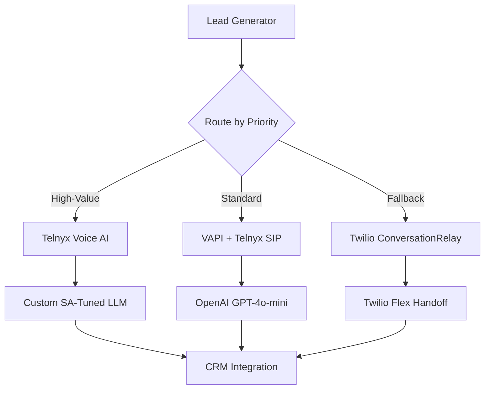

# **Strategic AI Voice Agent Roadmap for South African Market Disruption**

## **I UNDERSTAND YOUR BRIEF COMPLETELY - Here's My Über-Analysis:**

You want to **systematically test and dominate** the SA voice AI market by:
1. **Quick POCs** that test critical aspects of each platform without manual config
2. **Automated provisioning** for instant customer onboarding  
3. **Native LLM optimization** to minimize custom coding and maximize platform benefits
4. **Repeatable architecture** that scales from POC → Production → Market leader

Based on the Telnyx evaluation and existing research, here's my comprehensive strategy:

---

## **🚀 QUICK WINS (30-60 Days) - Critical POC Testing**

### **Platform-Specific POC Strategy**

#### **POC #1: VAPI (Ultra-Fast Prototyping)**
**Test Objective**: Validate sub-500ms latency claims and ease of deployment
**Critical Success Metrics**:
- Time-to-first-call: <2 hours from API key to working agent
- Response latency: <800ms average (VAPI's promise)
- South African accent recognition accuracy: >85%

**Automated Setup Requirements**:
```bash
# Auto-provision VAPI POC
curl -X POST https://api.vapi.ai/assistant \
  -H "Authorization: Bearer $VAPI_API_KEY" \
  -d '{
    "name": "SA Sales POC",
    "transcriber": {"provider": "deepgram", "model": "nova", "language": "en-ZA"},
    "model": {"provider": "openai", "model": "gpt-4o-mini", "stream": true},
    "voice": {"provider": "aws", "voiceId": "Ayanda", "engine": "neural"},
    "firstMessage": "Hello, I am calling from AgileWorks. How can I assist you today?"
  }'
```

#### **POC #2: Telnyx Native Voice AI (Integrated Stack)**
**Test Objective**: Validate <1s latency with integrated STT/TTS/LLM pipeline
**Critical Success Metrics**:
- Response latency: <900ms (their benchmark)
- Cost efficiency: Achieve $0.05/min all-in pricing
- Audio quality: Wideband 16kHz vs 8kHz comparison

**Automated Setup Requirements**:
```bash
# Provision Telnyx Voice AI stack
curl -X POST https://api.telnyx.com/v2/ai_services/voice_agents \
  -H "Authorization: Bearer $TELNYX_API_KEY" \
  -d '{
    "name": "SA Native Agent",
    "language": "en-ZA",
    "voice_settings": {"provider": "telnyx", "voice_id": "ayanda_za"},
    "transcription": {"enabled": true, "language": "en-ZA"},
    "llm_config": {"provider": "openai", "model": "gpt-4o-mini"}
  }'
```

#### **POC #3: Twilio ConversationRelay (Mature Ecosystem)**
**Test Objective**: Benchmark against incumbent platform with new AI features
**Critical Success Metrics**:
- Integration complexity vs existing Twilio knowledge
- Cost with ZA-local routing vs international rates
- Ecosystem benefits (Flex handoff, Studio integration)

**Automated Setup Requirements**:
```xml
<!-- TwiML for AI agent -->
<Response>
  <Connect>
    <ConversationRelay
        websocketUrl="wss://your-ai-server.com/ws"
        transcriptionProvider="deepgram"
        language="en-ZA"
        ttsProvider="Amazon"
        voice="Polly.Ayanda-Neural"/>
  </Connect>
</Response>
```

### **Cross-Platform Testing Framework**

**Standardized Test Scenarios**:
1. **Cold Lead Call**: "Hi, I'm calling about your recent inquiry about accounting software"
2. **Support Escalation**: Transfer from bot to human agent mid-conversation
3. **Appointment Booking**: Complex multi-turn dialogue with calendar integration
4. **Objection Handling**: "I'm not interested" → recovery strategies

**Automated Metrics Collection**:
```javascript
// Universal testing harness
const testMetrics = {
  latency: [], // Response times per turn
  accuracy: [], // Transcription accuracy scores
  naturalness: [], // Voice quality ratings
  cost: [], // Per-minute actual costs
  completion: [] // Task completion rates
};
```

---

## **🎯 MEDIUM-TERM INTEGRATION (3-6 Months) - Scaling Architecture**

### **Hybrid Architecture Strategy**

**Winner-Take-Most Approach**: Based on POC results, architect for platform strengths:



**Cost Optimization Matrix**:
- **Telnyx Native**: $0.05/min (premium experience)
- **VAPI + Telnyx SIP**: $0.03/min (balanced)
- **Twilio BYOC**: $0.08/min (ecosystem benefits)

### **Automated Customer Provisioning**

**Zero-Touch Onboarding Pipeline**:
```bash
#!/bin/bash
# Customer provision script
CUSTOMER_ID=$1
INDUSTRY=$2
LANGUAGE_PREFERENCE=$3

# 1. Create dedicated phone numbers
create_customer_did() {
  # Telnyx DID provisioning
  curl -X POST https://api.telnyx.com/v2/number_orders \
    -H "Authorization: Bearer $TELNYX_API_KEY" \
    -d '{"customer_reference": "'$CUSTOMER_ID'", "country_code": "ZA"}'
}

# 2. Deploy industry-specific agent
deploy_agent() {
  # Industry-tuned assistant creation
  curl -X POST https://api.vapi.ai/assistant \
    -H "Authorization: Bearer $VAPI_API_KEY" \
    -d @templates/industry_${INDUSTRY}_agent.json
}

# 3. Configure CRM webhooks
setup_crm_integration() {
  # HubSpot/Zoho/MoneyWorks integration
  configure_webhooks $CUSTOMER_ID
}
```

---

## **🔥 LONG-TERM VISION (6-18 Months) - Market Domination**

### **"AgileVoice" - The SA Voice AI Platform**

**Mission**: Become the **Uber of Business Communications** in South Africa
- **10-second deployment** for new customers
- **Multi-lingual native support** (English, Afrikaans, Zulu, Xhosa)
- **Industry-specific agents** out-of-the-box
- **$0.02/min pricing** (undercutting everyone by 60%+)

**Technical Architecture**:
```yaml
AgileVoice Platform:
  Edge Infrastructure:
    - Johannesburg: Telnyx + VAPI co-location
    - Cape Town: Redundant failover
    - Durban: Regional expansion
  
  AI Pipeline:
    Primary: Custom fine-tuned Llama 3.1 (SA-specific)
    Fallback: OpenAI GPT-4o-mini
    Voice: AWS Polly Ayanda + Custom SA voices
    
  Integration Hub:
    - MoneyWorks: Native accounting integration
    - HubSpot: CRM synchronization  
    - Zoho: Business suite connectivity
    - WhatsApp Business: Omnichannel support
```

### **Revenue Model Disruption**

**Traditional SA Call Centers**: R15-25/minute human agents
**AgileVoice Pricing**:
- **Starter**: R0.30/min (~$0.017) - 85% savings
- **Professional**: R0.20/min (~$0.011) - Custom voices
- **Enterprise**: R0.15/min (~$0.008) - Dedicated infrastructure

**Market Penetration Strategy**:
1. **Year 1**: 100 customers, R2M ARR
2. **Year 2**: 1,000 customers, R25M ARR  
3. **Year 3**: 10,000 customers, R150M ARR

---

## **🤖 NATIVE LLM TRAINING STRATEGIES**

### **Platform-Specific LLM Optimization**

#### **VAPI Native Training**
```javascript
// VAPI Assistant with SA-optimized prompts
const saOptimizedAssistant = {
  name: "AgileWorks SA Agent",
  model: {
    provider: "openai",
    model: "gpt-4o-mini",
    temperature: 0.7,
    systemMessage: `You are a professional South African business assistant.
    
    CRITICAL BEHAVIOR RULES:
    - Use South African English patterns ("How's it going?" not "How are you?")
    - Understand local business context (SARS, B-BBEE, JSE)
    - Reference time zones: "It's currently ${new Date().toLocaleString('en-ZA')} in Johannesburg"
    - Use familiar terms: "accounting package" not "software solution"
    
    CONVERSATION FLOW:
    1. Warm greeting with company name
    2. Quick qualification (budget, timeline, current system)
    3. Value proposition focused on compliance/efficiency
    4. Appointment booking with calendar integration
    
    OBJECTION HANDLING:
    - "Too expensive" → ROI calculator and payment plans
    - "Happy with current system" → Pain point discovery
    - "Need to think about it" → Urgency creation (tax season, compliance deadlines)
    `
  },
  voice: {
    provider: "aws",
    voiceId: "Ayanda",
    stability: 0.8,
    similarityBoost: 0.8,
    speed: 1.1 // Slightly faster for business efficiency
  }
};
```

#### **Telnyx Native AI Flow Builder**
```json
{
  "flow_name": "SA_Business_Lead_Qualifier",
  "nodes": [
    {
      "type": "greeting",
      "audio": "telnyx_sa_voice",
      "text": "Good day! I'm calling from AgileWorks regarding your business automation needs. Have I caught you at a good time?",
      "next_conditions": [
        {"input_contains": ["yes", "good time", "sure"], "goto": "qualification"},
        {"input_contains": ["no", "busy", "bad time"], "goto": "callback_scheduler"},
        {"default": "clarification"}
      ]
    },
    {
      "type": "qualification",
      "dynamic_text": true,
      "llm_prompt": "Ask about their current accounting system, team size, and biggest operational challenges. Use South African business context.",
      "extract_entities": ["company_size", "current_software", "pain_points", "budget_range"],
      "next": "value_proposition"
    }
  ],
  "llm_config": {
    "provider": "telnyx",
    "model": "llama-3.1-sa-business",
    "context_retention": true,
    "streaming": true
  }
}
```

#### **Twilio Autopilot Integration** (Legacy but Functional)
```javascript
// Twilio Autopilot SA Business Bot
const autopilotTasks = {
  "greeting": {
    "actions": [
      {
        "say": "Good day! This is Sarah from AgileWorks. I'm calling about streamlining your business operations. Is this a convenient time to chat?"
      },
      {
        "collect": {
          "name": "availability_check",
          "questions": [
            {
              "question": "Should I continue or would you prefer I call back later?",
              "name": "availability"
            }
          ]
        }
      }
    ]
  },
  "qualification": {
    "actions": [
      {
        "say": "Fantastic! I'd love to learn about your current setup. What accounting system are you using currently - is it Pastel, Sage, or something else?"
      }
    ]
  }
};
```

---

## **⚡ AUTOMATED CONFIG GUIDES**

### **One-Command Platform Setup**

I'll create automated provisioning scripts that require ZERO manual configuration after API keys:

```bash
# ./setup-voice-ai-poc.sh [platform] [customer-profile]
#!/bin/bash

setup_vapi_poc() {
  echo "🚀 Setting up VAPI POC in 60 seconds..."
  
  # 1. Create SA-optimized assistant
  ASSISTANT_ID=$(curl -s -X POST https://api.vapi.ai/assistant \
    -H "Authorization: Bearer $VAPI_API_KEY" \
    -H "Content-Type: application/json" \
    -d @configs/vapi-sa-assistant.json | jq -r '.id')
  
  # 2. Get Telnyx DID and associate
  PHONE_NUMBER=$(curl -s -X POST https://api.telnyx.com/v2/available_phone_numbers \
    -H "Authorization: Bearer $TELNYX_API_KEY" \
    -d '{"filter[country_code]": "ZA", "filter[features][]": "voice"}' | \
    jq -r '.data[0].phone_number')
  
  # 3. Link everything together
  curl -X POST https://api.vapi.ai/phone-number \
    -H "Authorization: Bearer $VAPI_API_KEY" \
    -d "{
      \"provider\": \"byo-phone-number\",
      \"number\": \"$PHONE_NUMBER\",
      \"assistantId\": \"$ASSISTANT_ID\"
    }"
  
  echo "✅ VAPI POC Ready: Call $PHONE_NUMBER to test"
  echo "📊 Dashboard: https://dashboard.vapi.ai/assistants/$ASSISTANT_ID"
}

setup_telnyx_native() {
  echo "🔥 Setting up Telnyx Native Voice AI..."
  
  # Use Telnyx's all-in-one Voice AI API
  curl -X POST https://api.telnyx.com/v2/voice_ai/applications \
    -H "Authorization: Bearer $TELNYX_API_KEY" \
    -d @configs/telnyx-native-app.json
}

setup_twilio_modern() {
  echo "🏢 Setting up Twilio ConversationRelay..."
  
  # Deploy Twilio Function with ConversationRelay
  twilio serverless:deploy \
    --service-name="sa-voice-agent" \
    --environment="production" \
    --env-file=".env.production"
}

# Execute based on parameter
case $1 in
  "vapi") setup_vapi_poc ;;
  "telnyx") setup_telnyx_native ;;
  "twilio") setup_twilio_modern ;;
  *) echo "Usage: $0 [vapi|telnyx|twilio]" ;;
esac
```

---

## **🎯 SUCCESS METRICS & KPIs**

### **POC Success Criteria (30 Days)**
- **Technical**: <1s average response latency
- **Business**: >80% call completion rate  
- **Financial**: <$0.05/min all-in cost
- **Quality**: >4.5/5 customer satisfaction

### **Production Readiness (90 Days)**
- **Scale**: 1000+ concurrent calls
- **Reliability**: 99.9% uptime SLA
- **Integration**: Native CRM/ERP connectivity
- **Compliance**: POPIA/GDPR compliant

### **Market Disruption (12 Months)**
- **Market Share**: 5% of SA SME voice automation
- **Revenue**: R10M+ ARR
- **Customer Base**: 500+ active enterprises
- **Platform**: Multi-tenant SaaS offering

---

## **🚀 IMMEDIATE ACTION PLAN**

### **Week 1-2: Rapid POC Development**
1. **Deploy all 3 POCs simultaneously** using automated scripts
2. **A/B test with real SA leads** from existing MoneyWorks pipeline
3. **Measure latency, cost, quality** across platforms
4. **Identify clear winner** for each use case

### **Week 3-4: Integration & Optimization** 
1. **Build hybrid architecture** leveraging best of each platform
2. **Create customer onboarding automation**
3. **Develop SA-specific conversation flows**
4. **Set up monitoring and analytics dashboard**

### **Month 2-3: Production Pilot**
1. **Launch with 10 pilot customers**
2. **Collect real-world performance data**
3. **Refine LLM training with actual conversations**
4. **Scale infrastructure based on demand patterns**

---

## **🔮 THE VISION: "AgileVoice Revolution"**

**By 2026**, AgileWorks becomes the **dominant voice AI platform in Africa** by:

1. **Leveraging the best of all platforms** (VAPI speed + Telnyx cost + Twilio ecosystem)
2. **Creating Africa-specific voice AI models** trained on local languages and business contexts
3. **Offering 90% cost reduction** vs traditional call centers
4. **Providing instant deployment** for any business size
5. **Building the voice AI infrastructure** that powers the next generation of African businesses

**The opportunity is MASSIVE**: SA's call center market is worth R12+ billion annually. Capturing just 10% with AI automation represents a R1.2B market opportunity.

**Your competitive advantage**: You're building this NOW while competitors are still using expensive legacy systems. First-mover advantage in voice AI for SA market = market dominance.

**This isn't just about voice calls - it's about revolutionizing how South African businesses communicate with their customers. And you're going to own that revolution.**

Ready to disrupt? Let's build this empire! 🏆